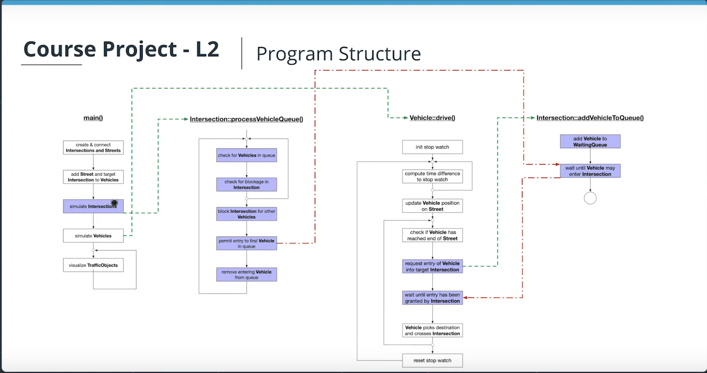

# CPPND: Program a Concurrent Traffic Simulation

This repository contains a concurrent traffic simulation program using thread-programming techniques in C++. This project was part of the Udacity Nano Degree program for C++ and the simulation in this respository has been build up step-by-step throughout the Concurrency Course of the program. The focus has been to get familiar with thread-programming and the tools provided by the standard library for this. 

In the simulation each traffic participant runs in its own thread, as well as parts of the infrastructure such as the intersections and traffic lights. The visualization below shows the running simulation, in which traffic participants (larger circles) are approaching traffic lights (smaller circles) which are either green or red. The traffic participants are slowing down when they are approaching the intersection and have to stop when the traffic light is red. If multiple traffic participants are approaching an intersection at the same time, a FIFO queue handles the entry to the intersection, so that traffic participants, which first entered the intersection are also the ones to first pass the intersection.

## Program structure

In the `main()`(see file 'TrafficSimulator-Final.cpp') the city infrastructure is set up before the simulation is started. The infrastructure consists of intersections (each with a traffic lights) and streets, which connect the intersections. After the setup, the simulation of intersections and vehicles (traffic participants) is started, each running in its own thread.

The challenge is now to build up a suitable and thread-safe communication protocol between vehicles and intersections for the simulation. The green arrows in the schematic below show the start of a new thread respectively for the simulation of each vehicle and intersection, the red arrows show the communication between simulation treads. For the correct communication and time-scheduling between threads techniques such as mutexes, locks and message queues are then used to handle the entrance of a vehicle into an intersection, where each intersection has its own queue to allow entrance and passing of vehicles by FIFO principle.

## Dependencies for Running Locally
* cmake >= 2.8
  * All OSes: [click here for installation instructions](https://cmake.org/install/)
* make >= 4.1 (Linux, Mac), 3.81 (Windows)
  * Linux: make is installed by default on most Linux distros
  * Mac: [install Xcode command line tools to get make](https://developer.apple.com/xcode/features/)
  * Windows: [Click here for installation instructions](http://gnuwin32.sourceforge.net/packages/make.htm)
* OpenCV >= 4.1
  * The OpenCV 4.1.0 source code can be found [here](https://github.com/opencv/opencv/tree/4.1.0)
* gcc/g++ >= 5.4
  * Linux: gcc / g++ is installed by default on most Linux distros
  * Mac: same deal as make - [install Xcode command line tools](https://developer.apple.com/xcode/features/)
  * Windows: recommend using [MinGW](http://www.mingw.org/)

## Basic Build Instructions

1. Clone this repo.
2. Make a build directory in the top level directory: `mkdir build && cd build`
3. Compile: `cmake .. && make`
4. Run it: `./traffic_simulation`.

## Project Tasks

The list below shows the tasks, which have been fulfilled in order to build up the running simulation: 

- **Task FP.1** : Define a class `TrafficLight` which is a child class of `TrafficObject`. The class shall have the public methods `void waitForGreen()` and `void simulate()` as well as `TrafficLightPhase getCurrentPhase()`, where `TrafficLightPhase` is an enum that can be either `red` or `green`. Also, add the private method `void cycleThroughPhases()`. Furthermore, there shall be the private member `_currentPhase` which can take `red` or `green` as its value.
- **Task FP.2** : Implement the function with an infinite loop that measures the time between two loop cycles and toggles the current phase of the traffic light between red and green and sends an update method to the message queue using move semantics. The cycle duration should be a random value between 4 and 6 seconds. Also, the while-loop should use `std::this_thread::sleep_`for to wait 1ms between two cycles. Finally, the private method `cycleThroughPhases` should be started in a thread when the public method `simulate` is called. To do this, use the thread queue in the base class.
- **Task FP.3** : Define a class `MessageQueue` which has the public methods send and receive. Send should take an rvalue reference of type TrafficLightPhase whereas receive should return this type. Also, the class should define an `std::dequeue` called `_queue`, which stores objects of type `TrafficLightPhase`. Finally, there should be an `std::condition_variable` as well as an `std::mutex` as private members.
- **Task FP.4** : Implement the method `Send`, which should use the mechanisms `std::lock_guard<std::mutex>` as well as `_condition.notify_one()` to add a new message to the queue and afterwards send a notification. Also, in class `TrafficLight`, create a private member of type `MessageQueue` for messages of type `TrafficLightPhase` and use it within the infinite loop to push each new `TrafficLightPhase` into it by calling send in conjunction with move semantics.
- **Task FP.5** : The method receive should use `std::unique_lock<std::mutex>` and `_condition.wait()` to wait for and receive new messages and pull them from the queue using move semantics. The received object should then be returned by the receive function. Then, add the implementation of the method `waitForGreen`, in which an infinite while-loop runs and repeatedly calls the `receive` function on the message queue. Once it receives `TrafficLightPhase::green`, the method returns.
- **Task FP.6** : In class Intersection, add a private member `_trafficLight` of type `TrafficLight`. In method `Intersection::simulate()`, start the simulation of `_trafficLight`. Then, in method `Intersection::addVehicleToQueue`, use the methods `TrafficLight::getCurrentPhase` and `TrafficLight::waitForGreen` to block the execution until the traffic light turns green.
